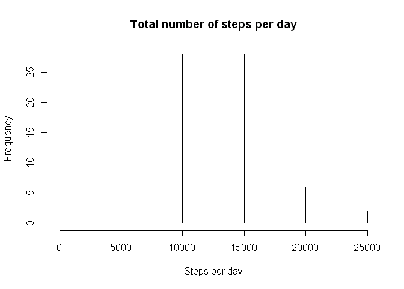
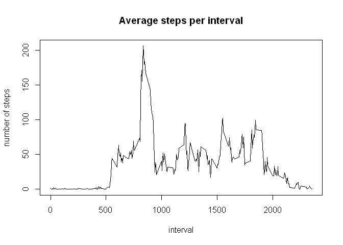
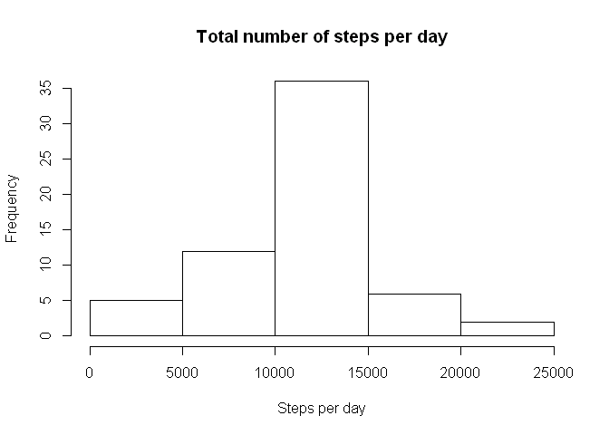
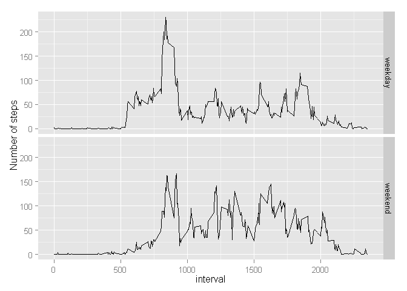

# Reproducible Research: Peer Assessment 1


## Loading and preprocessing the data


```r
setwd("~/Documents/coursera/RepData/RepData_PeerAssessment1")
library(data.table)
activity <- read.csv("activity.csv")
dt <- as.data.table(activity)
```


## What is mean total number of steps taken per day?

First we sum the number of steps per day from the data table. Some days have NA and therefore we remove NA's when findingt the mean.


```r
total_steps <- dt[,sum(steps), by=date]
hist(total_steps$V1, main = "Total number of steps per day", xlab="Steps per day")
```

 

```r
results <- mean(total_steps$V1, na.rm = TRUE)
results <- c(results, median(total_steps$V1, na.rm =TRUE))
results
```

```
## [1] 10766.19 10765.00
```


## What is the average daily activity pattern?


```r
ave_per_int <- dt[,mean(steps,na.rm = TRUE), by=interval]

plot(V1~interval, data=ave_per_int, type="l",
     main="Average steps per interval",
     ylab="number of steps")
```

 

```r
ave_per_int[ave_per_int$V1==max(ave_per_int$V1),]
```

```
##    interval       V1
## 1:      835 206.1698
```


## Imputing missing values


```r
# Total number of missing values
sum(is.na(dt$steps))
```

```
## [1] 2304
```

```r
# Impute missing values using average steps for that interval, rounded to in integer

setkey(dt, interval)
activity2 <- dt[ave_per_int]

activity2$steps[is.na(activity2$steps)] <- round(activity2$V1[is.na(activity2$steps)])

total_steps <- activity2[,sum(steps), by=date]
hist(total_steps$V1, main = "Total number of steps per day", xlab="Steps per day")
```

 

```r
results2 <- mean(total_steps$V1, na.rm = TRUE)
results2 <- c(results2, median(total_steps$V1, na.rm =TRUE))

results2
```

```
## [1] 10765.64 10762.00
```

```r
res <- data.frame(m = c("mean","median"), results, results2)
res$diff <- res$results - res$results2

# The difference between mean and medium is shown in the diff column
# This is the effect of imputing the data
res
```

```
##        m  results results2     diff
## 1   mean 10766.19 10765.64 0.549335
## 2 median 10765.00 10762.00 3.000000
```


## Are there differences in activity patterns between weekdays and weekends?


```r
activity2$date <- as.Date(activity2$date)

# "laugardagur" and "sunnudagur" are the days of the weekend in Icelandic
activity2 <- activity2[,weekend:= weekdays(date) %in% c("laugardagur","sunnudagur")]

activity2$weekend <- as.factor(sapply(activity2$weekend,function(isWeekend){if(isWeekend) "weekend" else "weekday"}))

ave_int_week <- activity2[,mean(steps), by=list(interval,weekend)]

library(ggplot2)
qplot(x= interval, y= V1, geom = "line", ylab="Number of steps", facets= weekend ~ ., data = ave_int_week)
```

 


